# Application Flows Documentation

## Authentication Flow

### 1. User Registration
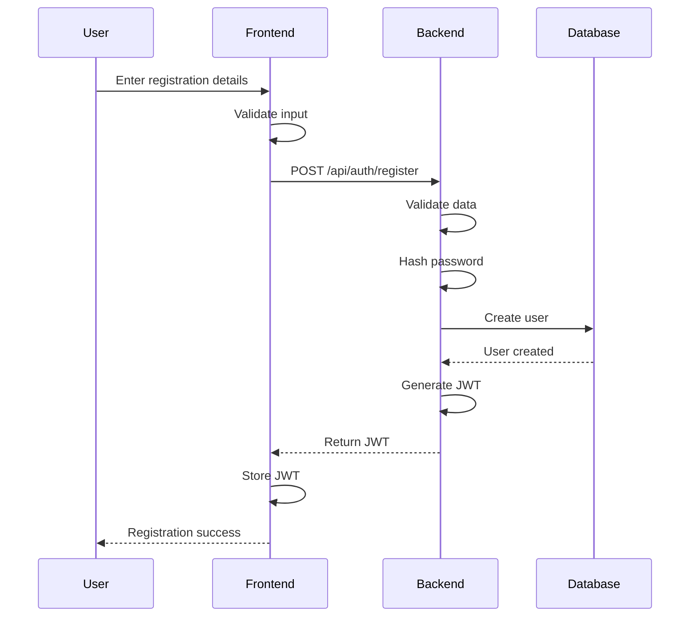

### 2. User Login
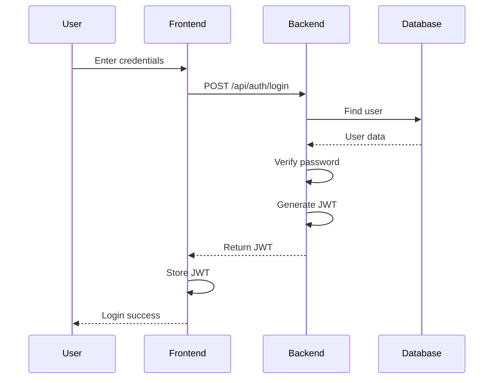

## Booking Flow

### 1. Create Booking
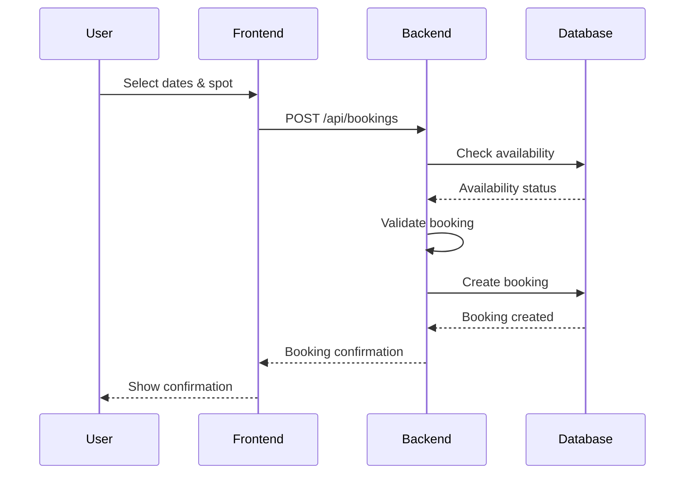

### 2. Cancel Booking
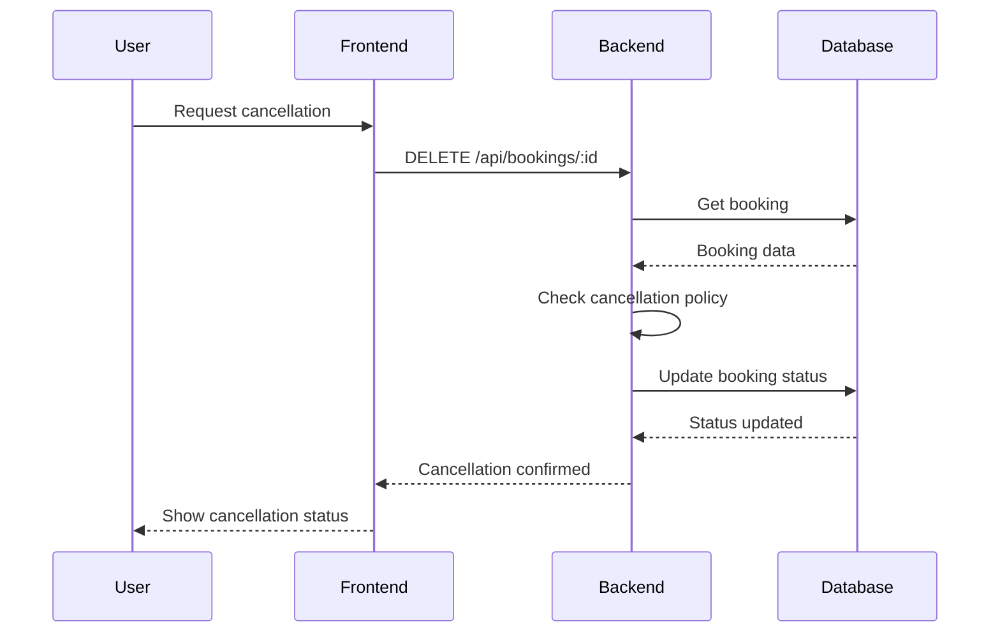

## Review Flow

### 1. Submit Review
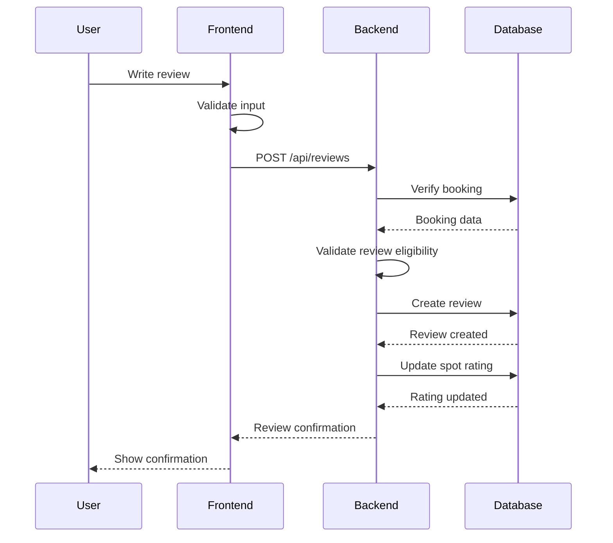

## Camping Spot Management Flow

### 1. Create Camping Spot
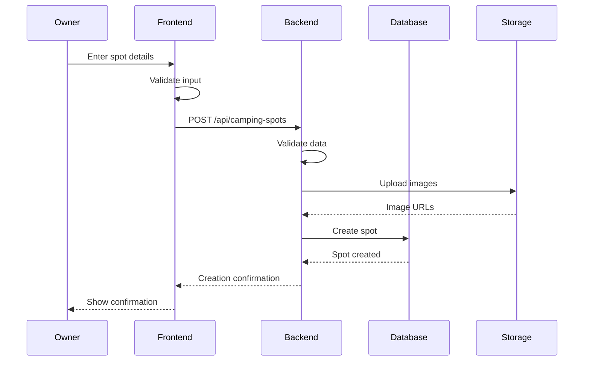

### 2. Update Camping Spot
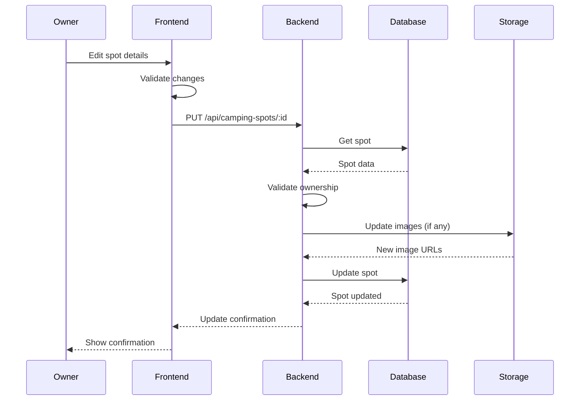

## Search and Filter Flow

### 1. Search Camping Spots
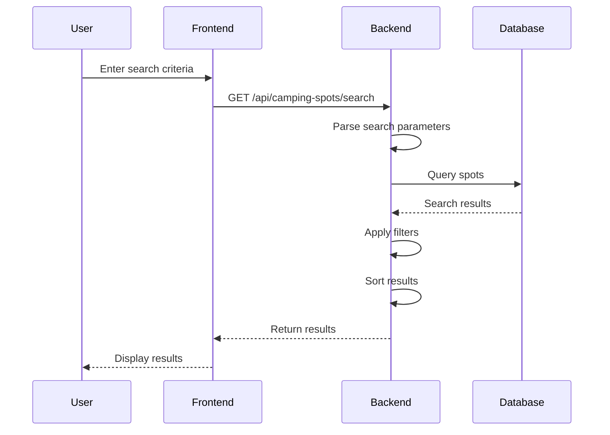

## Payment Flow

### 1. Process Payment
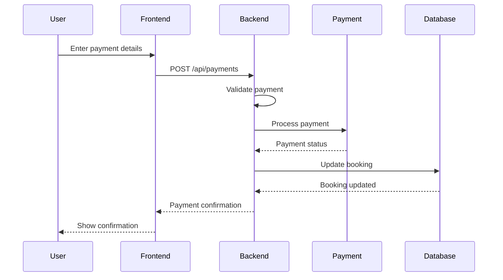

## Chat Flow

### 1. Send Message
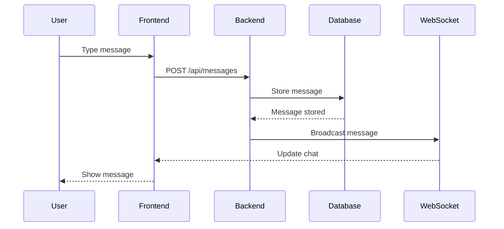

## Error Handling Flow

### 1. API Error Handling
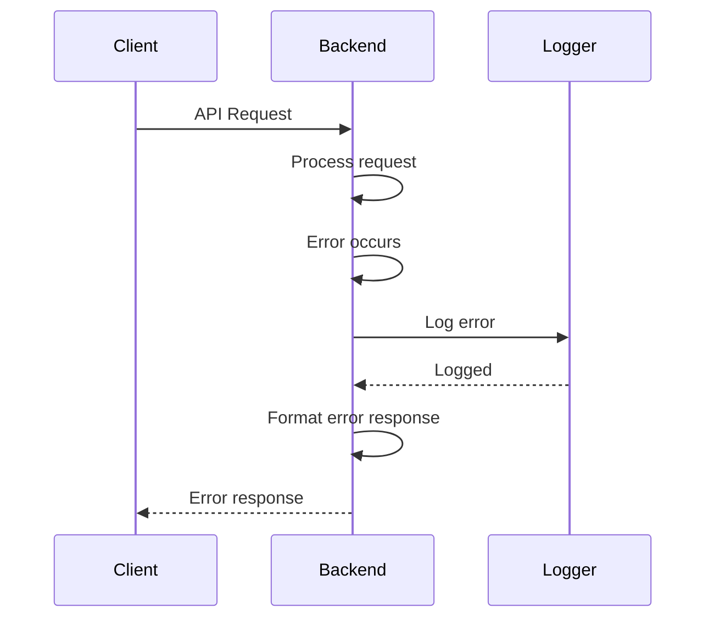

## Data Validation Flow

### 1. Input Validation
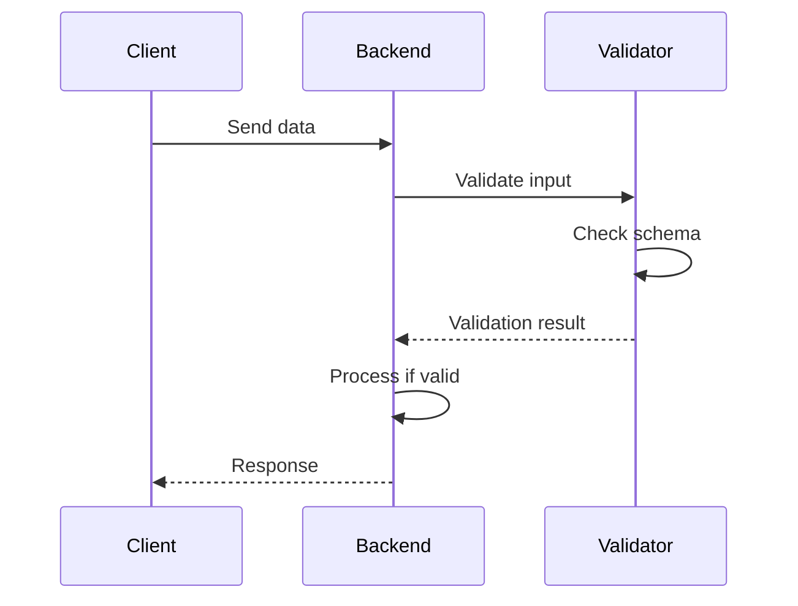

## File Upload Flow

### 1. Image Upload
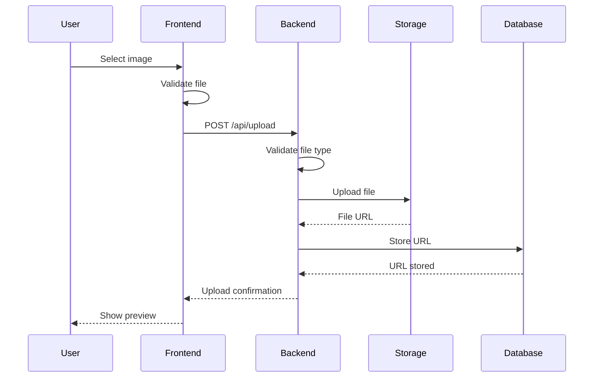